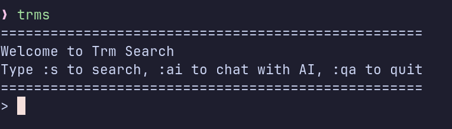
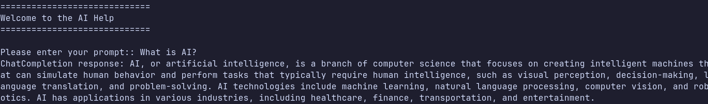

# TRM Search

This is a simple command-line interface (CLI) program written in Go to interact with google search engine and Open AI.

## Features
- Fetches top 10 Google Search Results.
- Fuzzy find the results and open link in browser.



- AI help


## Prerequisites
- Go programming language installed on your machine.
- A valid Google Search API key and Search Engine ID (CX).
- Open AI API key

## Setup
1. Clone this repository to your local machine.
2. Navigate to the directory containing the Go files.

## Configuration
Before running the program, you need to add your Google API Search Key and Search Engine ID (CX) to the program:

Use your keys to create a new `.env` file based on the `.env.template`.

[OpenAI API](https://platform.openai.com/api-keys)

you can find `CX` and `GOOGLE_API_KEY` from
[Google Custom Search](https://developers.google.com/custom-search/v1/overview#search_engine_id)

## Installation
To install the program, run the following commands in your terminal:

```bash
go mod download
go build -o main
```


This will download the necessary Go modules and build your program into an executable file named `main`.

## Usage

To run the program, use the following command:

```bash
./main
```

## License

This project is open source and available under the [MIT License](LICENSE).
